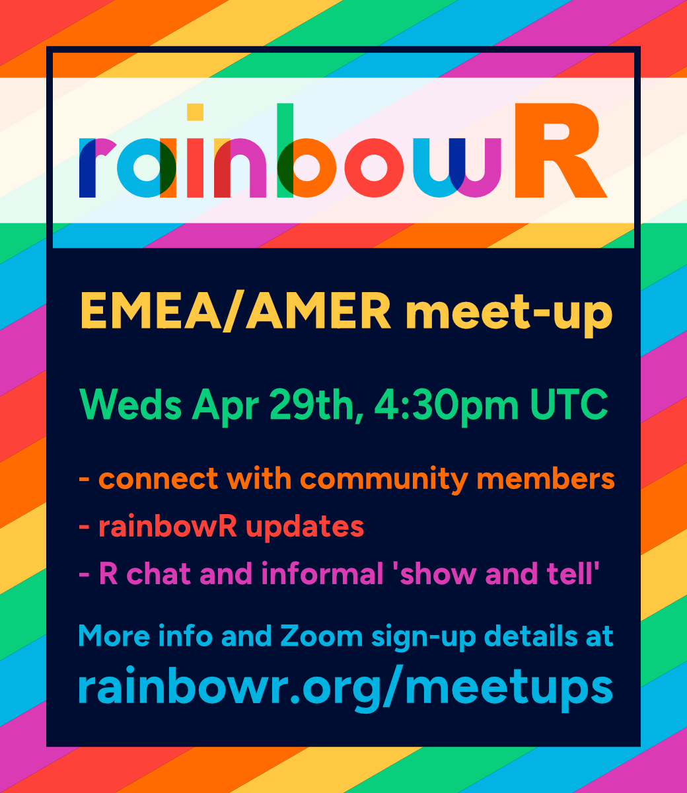
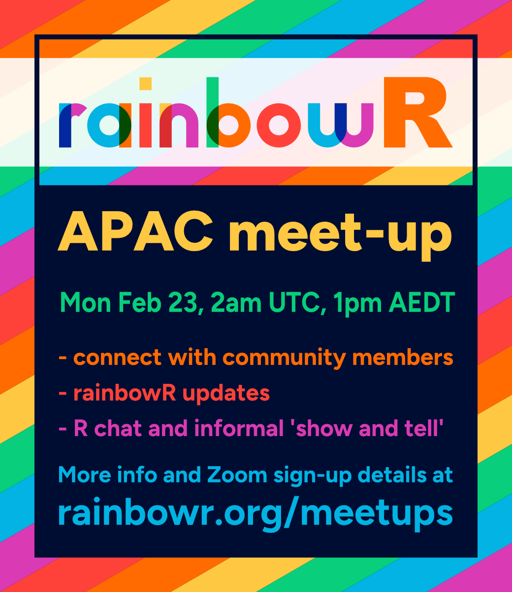

## Next meet-ups

::: {.callout-note}
We're using the new Quarto extension [`localtime`](https://github.com/EllaKaye/localtime) to render the meeting times in your local time in the browser! These appear just under the flier image. The UTC times are shown in the fliers, for comparison.

Please note that `localtime` is currently experimental. Please [let us know](https://github.com/EllaKaye/localtime/issues) if something doesn't look right.

Note that March is a particularly tricky month, with clock-changes on different dates in different parts of the world.
:::

:::: {.columns}
::: {.column width="45%"}

****

[ Register EMEA/AMER](https://us06web.zoom.us/meeting/register/auyxlxNdQvq5FyXG2CbcuQ){.btn .icon-link}

:::

::: {.column width="10%"}
:::

::: {.column width="45%"}

****

[ Register APAC](https://us06web.zoom.us/meeting/register/yIiwa8CzQ9S1ErB5y-XDgg){.btn .icon-link}
:::
::::

## Future meet-ups

We hold online meetups, over Zoom. 

::: {.callout-note}
## EMEA/AMER meet-up
These will usually be on the **last Wednesday of each month, at 4:30pm Europe/London time**.

[ Register EMEA/AMER](https://us06web.zoom.us/meeting/register/auyxlxNdQvq5FyXG2CbcuQ){.btn .icon-link}
:::

::: {.callout-note}
## APAC meet-up
These will usually be on the **last Monday of each month, at 1pm Australia/Sydney time**.

*Note that although we're calling this the APAC region meet-up, this timezone could also work well for folks on the Western side of the Americas.*

[ Register APAC](https://us06web.zoom.us/meeting/register/yIiwa8CzQ9S1ErB5y-XDgg){.btn .icon-link}
:::

We schedule the meet-ups as recurring Zoom meetings. You only need to register once (per meetup series) you'll get a calendar invitation for all future scheduled meet-ups (though of course no requirement to come to all of them!).

Details will also be shared via [Mastodon](https://tech.lgbt/@rainbowR){target="_blank"}, [Bluesky](https://bsky.app/profile/rainbowr.org), [LinkedIn](https://www.linkedin.com/company/rainbowr/) and our newsletter^[You can opt-in to the newsletter when you [join the community](https://docs.google.com/forms/d/1y7SOWE3IW-fpR_5Cd4mK-CMUpFZ-hvhY4cTj34JqTVE/){target="_blank"}.] in the run-up to each meet-up.

## About our meet-ups

We usually promote meetups a couple of weeks before they take place.
The best place to hear about them is on [Mastodon](https://tech.lgbt/@rainbowR), [Bluesky](https://bsky.app/profile/rainbowr.org), [LinkedIn](https://www.linkedin.com/company/rainbowr) or via our mailing list, which you can opt in to when you [join](https://docs.google.com/forms/d/1y7SOWE3IW-fpR_5Cd4mK-CMUpFZ-hvhY4cTj34JqTVE/).

These are friendly, informal gatherings, to connect with fellow community members and chat (mostly about R).

Each meetup starts with a round of introductions, followed by any updates from the rainbowR team, e.g. discussing initiatives for the group, community organisation etc.
The majority of the meetup is usually spent chatting about R. We invite participants to 'show and tell' -- they can share something related to R or Quarto.
It could be something they're working on, or a resource/package they've found that they're enjoying using.
It's also a chance to ask R-related questions -- there's probably someone on the call who can help!
Of course, you don't have to show something -- there's no pressure to do so!

We require registration in advance. This helps keep the meetup safe.
